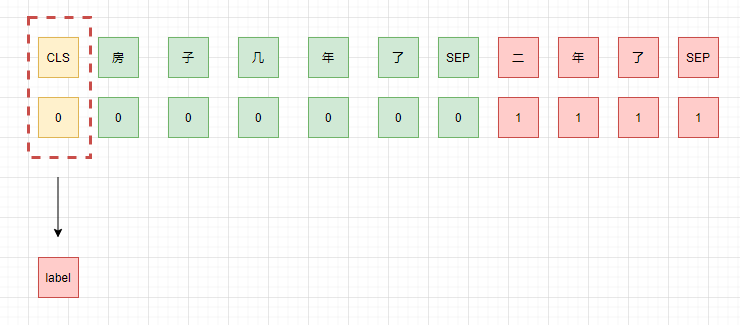
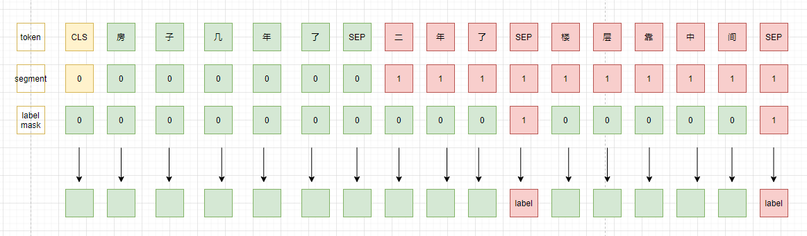
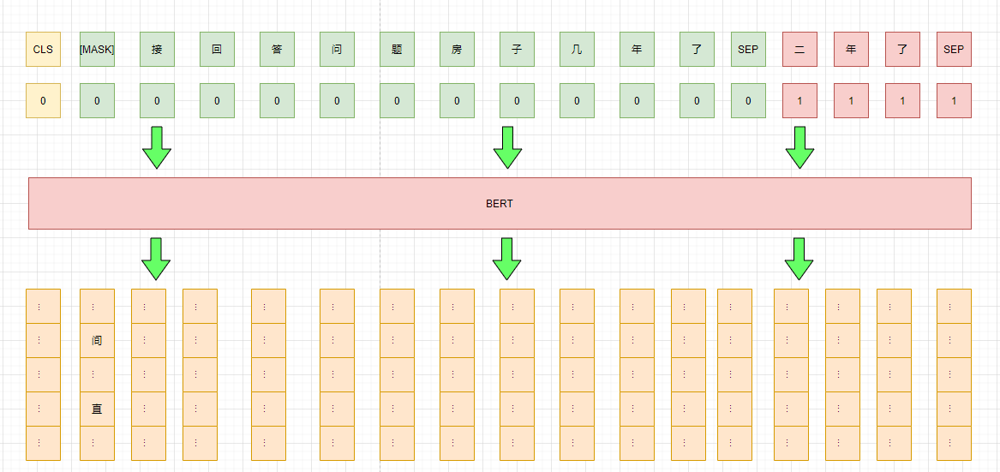

# 比赛
贝壳找房-房产行业聊天问答匹配， 比赛地址[https://www.datafountain.cn/competitions/474/datasets](https://www.datafountain.cn/competitions/474/datasets)

# 简单说明
样本为一个问题多个回答，其中回答有的是针对问题的回答（1），也有不是的（0），其中回答是按顺序排列的。即：
query1: [(answer1, 0), (answer2, 1),...]
任务是对每个回答进行分类，判断是不是针对问题的回答。

# pretrain model weights
预训练模型使用的是华为开源的[nezha-base-wwm](https://github.com/huawei-noah/Pretrained-Language-Model/tree/master/NEZHA-TensorFlow)

# Baseline
## 思路一：
不考虑回答之间的顺序关系，将其拆为query-answer 对，然后进行判断。
比如现在的样本是: {query: "房子几年了", answers: [("二年了", 1), ("楼层靠中间"， 0)]},此时我们将其拆分为单个query-answer pair，即：
[{query: "房子几年了", answer: "二年了", label: 1}, {query: "房子几年了", answer: "楼层靠中间", label: 0}]

代码实现：[pair_match](https://github.com/xv44586/ccf_2020_qa_match/ccf_2020_qa_match_pair.py)

单模型提交f1: 0.752

## 思路二：
考虑对话连贯性，同时考虑其完整性，将所有回答顺序拼接后再与问题拼接，组成query-answer1-answer2，然后针对每句回答进行分类。
上面的例子将被组成样本：{query: "房子几年了", answer: "两年了[SEP]楼层靠中间[SEP]", label: [mask, mask, mask, 0, mask, mask, mask,mask,mask, 0]}
即：将每句回答后面的[SEP] 作为最终的特征向量，然后去做二分类。

代码实现：[match_point](https://github.com/xv44586/ccf_2020_qa_match/ccf_2020_qa_match_point.py)

单模型提交f1: 0.75

## 思路三：
Pattern-Exploiting Training(PET)，即增加一个pattern，将任务转换为MLM任务，然后通过pattern的得分来判断对应的类别。
如本次样本可以添加一个前缀pattern："简接回答问题"/"直接回答问题"，分别对应label 0/1,pattern的得分只需看第一个位置中"间"/"直" 两个token的概率谁高即可。
此外，训练时还可以借助bert的预训练任务中的mlm任务增强模型的泛化能力。更详细的请介绍请查阅[文本分类秒解](https://xv44586.github.io/2020/10/25/pet/)

对于本次样本，对应的示意图如下：

对应代码实现：[pet classification](https://github.com/xv44586/ccf_2020_qa_match/ccf_2020_qa_match_pet.py)

单模型提交f1: 0.76
